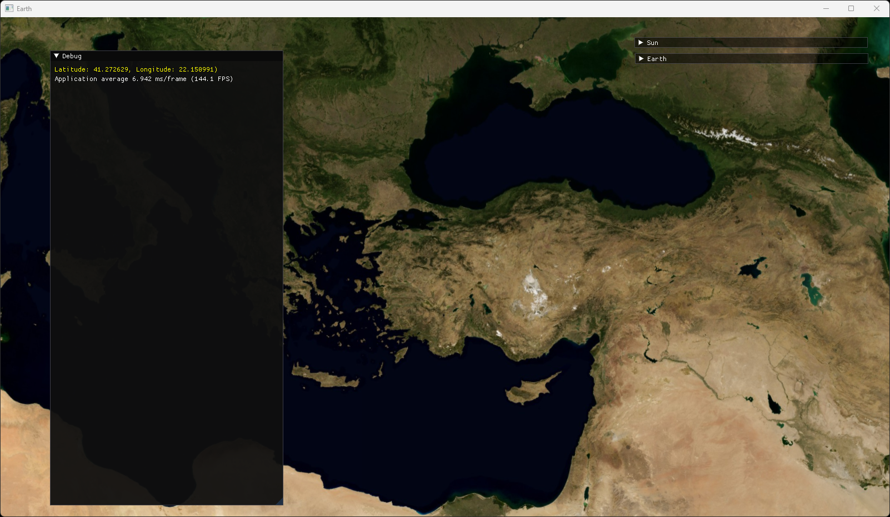
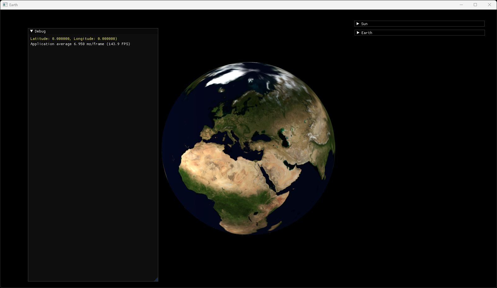

# Earth
3D earth rendering using `OpenGL` and `Qt`.

## Build
1) Install `CMake 3.25.1` or above.
2) Install `Visual Studio 2022` and `MSVC C++ v143 Compiler`.
3) Install `Qt 5.x.y MSVC2019 64bit` kit.
4) Set environment variable `Qt5_DIR` as `C:\Qt\5.x.y\msvc2019_64`.
5) Clone the repo `git clone https://github.com/berkbavas/Earth.git`.
6) Create a folder `mkdir Build`.
7) Enter the folder `cd Build`.
8) Run CMake `cmake ..`.
9) Open `Earth.sln` with `Visual Studio 2019`.
10) Build & Run with `Release` config.

## Screenshots

