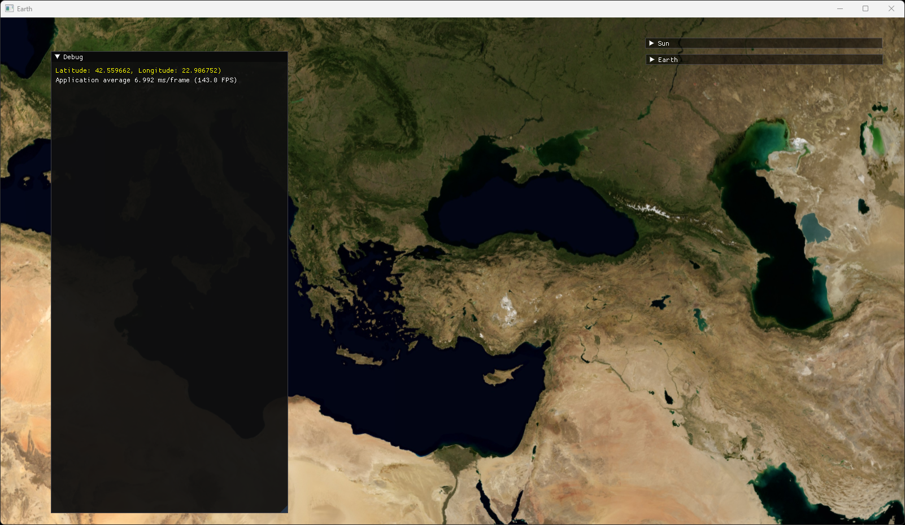
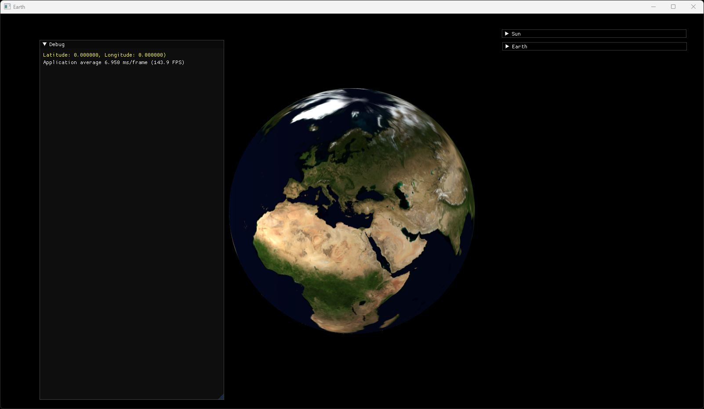

# Earth
3D Earth Rendering in OpenGL

Calculating Geodetic Coordinates from Mouse Coordinates

## Build
1) Install `CMake 3.25.1`.
2) Install `Visual Studio 2019 and MSVC C++ Compiler`.
3) Install `Qt 5.15.2 MSVC2019 64bit` kit.
4) Clone the repo `git clone https://github.com/berkbavas/Earth.git`.
5) Create a folder `mkdir Build`.
6) Enter the folder `cd Build`.
7) Run CMake `cmake ..`.
8) Open `Earth.sln` with `Visual Studio 2019`.
9) Build & Run.

## Screenshots

